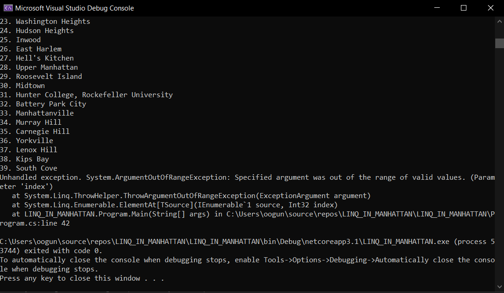

# LINQ CONSOLE APPLICATION

Author: Lami Beach
____________________________________________________________________________________________________________________________________________________________________________________________________________________________________________________________________________________________________________________________________________________________________________________________________________________________________________________________________________________________________________________________________________________________________________________________________________________________________________________________________________________________________________________

Description :

I want to query my json data and print what's asked of me in the console.

I want to output all of the neighborhoods in this data list (Final Total: 147 neighborhoods)
Then I want to filter out all the neighborhoods that do not have any names (Final Total: 143)
I removed the duplicates (Final Total: 39 neighborhoods)
Rewrite at least one of these questions only using the opposing method (example: Use LINQ Query statements instead of LINQ method calls and vice versa.)

____________________________________________________________________________________________________________________________________________________________________________________________________________________________________________________________________________________________________________________________________________________________________________________________________________________________________________________________________________________________________________________________________________________________________________________________________________________________________________________________________________________________________________________

Getting Started
Clone this repository to your local machine.

$ git clone [https://github.com/Omac092627/LINQ_Application.git]
To run the program from Visual Studio:
Select File -> Open -> Project/Solution

Next navigate to the location you cloned the Repository.

Double click on the LINQ_Application directory.

Then select and open LINQ_Application

____________________________________________________________________________________________________________________________________________________________________________________________________________________________________________________________________________________________________________________________________________________________________________________________________________________________________________________________________________________________________________________________________________________________________________________________________________________________________________________________________________________________________________________

Visuals

Output 147 neighbors - woop woop

Output neighbors excluding the non-named - 143

Output neighbors exluding duplicates

____________________________________________________________________________________________________________________________________________________________________________________________________________________________________________________________________________________________________________________________________________________________________________________________________________________________________________________________________________________________________________________________________________________________________________________________________________________________________________________________________________________________________________________